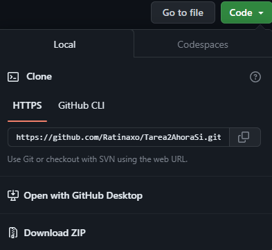
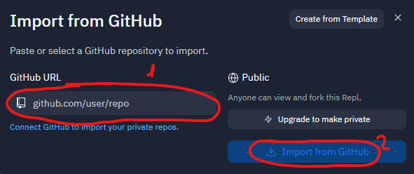
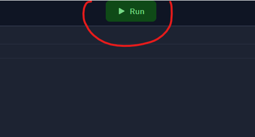
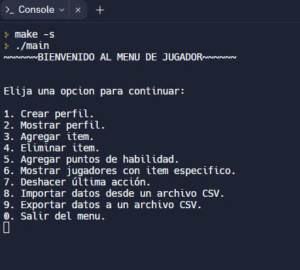

# Tarea 2:

El programa permite importar y exportar una lista de jugadores con sus respectivos inventarios desde un archivo CSV, para pluego poder crear, mostar o actualizar los perfiles de los jugadores mediante un menú de 10 opciones.

1.- Crear un perfil
2.- Mostrar un perfil
3.- Agregar un item
4.- Eliminar un item
5.- Agregar puntos de habilidad
6.- Mostrar a todos los jugadores con algún item en especifico
7.- Deshacer última acción realizada en el perfil de un jugador
8.- Importar datos desde un archivo CSV
9.- Exportar datos desde un archivo CSV
0.- Salir del menú y cerrar programa

## Features
Todas las funciones funcionan correctamente, sin embargo hay que tener algunas consideraciones.

- A la hora de ingresar algún tipo de texto, no utilizar tildes ni caracteres especiales.
- Si por algún motivo se elije una opción no desdeada, debe reiniciarse el programa

## Herramientas Utilizadas

- [Replit.com](https://replit.com/)

Durante el desarrollo grupal de la tarea n°2, se utilizó principalmente el servicio online "replit.com" para lograr un trabajo en conjunto.

- [Github](https://github.com)
  
Durante el desarrollo del programa, se utilizó github para utilizar la herramienta de commits y así conseguir una mejor organización de las funcinoes ya listas.

- [Discord](https://discord.com)

Durante el desarrollo del programa se utilizó esta aplicación para conseguir una mejor organización entre nosotros y resolver dudas entre nosotros.

## Co-evaluación grupal

Este punto consiste en una lista de cualidades positivas y por mejorar de cada integrante, las cuales se deberán tener en cuenta para mejorar el trabajo en equipo en un futuro.
Se debe justificar.

[ + ] = Positivo

[ ! ] = Por mejorar.

 

Felipe Bechan:

- Ignacio Layana [ ! ] Apesar de tener tiempos de trabajo tardio entrego su parte de manera correcta
- José Villamayor [ ! ] En etapas iniciales y medias del proyecto se encontraba bastante ausente. Finalmente entregó sus partes encomendadas con buen desarrollo. Mejorar responsabilidad.
- Ricardo Toro [ ! ] A pesar de atrasarse un poco, fue responsable con la entrega y tuvo buena comunicación con el resto del equipo demostrando cierto interés en esta tarea.

Ricardo Toro

- Felipe Bechan[ + ] El trabajo realizado fue excelente, organizado y cumplido en el plazo establecido. La comunicación fue fluida y se mostró una actitud responsable en todo momento.
- Ignacio Layana [ + ] Organizado, atento al trabajo y comunicativo.
- José Villamayor [ ! ] Al principio del trabajo estaba algo ausente. En etapa media empezó a realizar sus respectivos trabajos y entregandolos sin problemas.

Ignacio Layana: 

- Felipe Bechan[ + ] Se destacó por un desempeño sobresaliente, manteniendo un alto nivel de orden y puntualidad en cada tarea. Además, la comunicación fue eficaz y se evidenció un enfoque responsable en todo momento.
- José Villamayor[ + ] Buen Desarrollo del trabajo, comunicativo y resonsable en todo momento.
- Ricardo Toro [ + ] Fue responsable en todos los aspectos del trabajo.

  
José Villamayor: 

- Felipe Bechan[ + ] El rendimiento fue impecable, se mostró una gran capacidad para la organización y el cumplimiento de los plazos establecidos. Asimismo, la comunicación fue clara y se demostró un compromiso responsable en todo momento.
- Ignacio Layana [ + ] Organizado, atento al trabajo y comunicativo.
- Ricardo Toro [ + ] Fue responsable en todos los aspectos del trabajo, faltó más comunicación con el resto del equipo

  
Puntaje trabajo en equipo en relación a los puntos anteriores.
- Se utiliza la siguiente escala:
- 10 pts - Excelente, no hay que mejorar nada.
- 7 pts - Aceptable, hay que mejorar cosas mínimas.
- 5 pts - A pesar de haber trabajado, se deben mejorar algunos aspectos.
- 3 pts - Realizó el mínimo, cumplió con muy poco.
- 1 pts - No cumplió con ninguna expectativa.
- TOTAL: 40/40

Felipe Bechan:
- RT: 07
- IL: 07
- JV: 07
- Puntaje: 21/30

Ricardo Toro:
- FB: 10
- IL: 10
- JV: 08
- Puntaje: 28/30

Ignacio Layana:
- FB: 10
- RT: 10
- JV: 10
- Puntaje: 30/30

José Villamayor:
- FB: 10
- RT: 10
- IL: 10
- Puntaje: 30/30

## ¿Cómo ejecutar?

Para compilar el programa se deberá seguir los siguientes pasos:

-1. Ir al repositorio de github y copiar el link HTTPS.

-2. Ir a replit.com y crear un nuevo repl y selección la opción de importar desde github.

-3. Pegar el link anteriormente(1) copiado y seleccionar nuevamente la opción de importar(2).

-4. Esperar a que el archivo se importe (Puede demorarse un poco).

-5. Hacer click en 'RUN' en la parte superior de la pantalla.

-6. Se le abrirá una consola, ya puede utilizar el programa.

## Autores
-Grupo Programines

- [@FELIPEBECHAN](https://github.com/felipebechan)
- [@IGNACIOLAYANA](https://github.com/HatziveIgnacio)
- [@RICARDO TORO](https://github.com/Ratinaxo)
- [@JOSEVILLAMAYOR](https://github.com/jochevipe)
